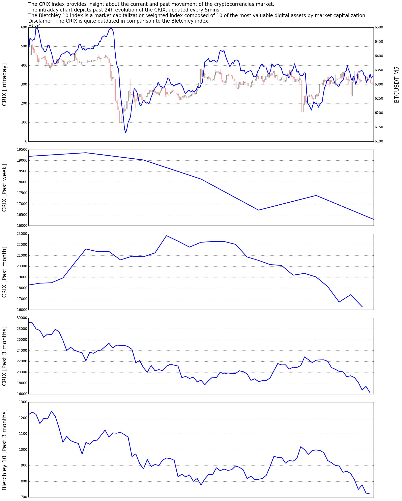

#  Trading Analysis Bot

[](http://mrjbq7.github.io/ta-lib/)
[](https://opensource.org/licenses/MIT)

## Requirements

- Telegram library: python-telegram-bot
- Exchange library: python-binance
- Computational libraries: numpy, TA-lib
- Visualization library: matplotlib
- Database library: psycopg2

## Features

- Standard technical indicators: Pivot points, RSI, MA, etc
- Order flow trading: Volume profile, orderbook
- Market indexes and rankings: CRIX, Bletchley index, NVT ratio, etc
- Social sentiment: Twitter, Reddit, Facebook
- Developer activities: GitHub
- Trading sessions
- Customized notifications
- Admin and user management

## Run on local machine

```
pip install -r requirements.txt
pip install TA-lib
```

```
# For Windows
set TELEGRAM_TOKEN=XXXXXXXXXXXXXXXXXXXXXXXXXXXXXX 
set SECRET_KEY=XXXXXXXXXXXXXXXXXXXXXXXXXXXXXX 
set API_KEY=XXXXXXXXXXXXXXXXXXXXXXXXXXXXXX
set DB_NAME=XXXXXXXXXXXXXXXXXXXXXXXXXXXXXX
set DB_USERNAME=XXXXXXXXXXXXXXXXXXXXXXXXXXXXXX
set DB_HOST=XXXXXXXXXXXXXXXXXXXXXXXXXXXXXX
set DB_PASSWORD=XXXXXXXXXXXXXXXXXXXXXXXXXXXXXX
set ADMIN_ID=XXXXXXXXXXXXXXXXXXXXXXXXXXXXXX
set ADMIN_USERNAME=XXXXXXXXXXXXXXXXXXXXXXXXXXXXXX
python bot.py
```

```
# For Linux
export TELEGRAM_TOKEN=XXXXXXXXXXXXXXXXXXXXXXXXXXXXXX 
export SECRET_KEY=XXXXXXXXXXXXXXXXXXXXXXXXXXXXXX 
export API_KEY=XXXXXXXXXXXXXXXXXXXXXXXXXXXXXX
export DB_NAME=XXXXXXXXXXXXXXXXXXXXXXXXXXXXXX
export DB_USERNAME=XXXXXXXXXXXXXXXXXXXXXXXXXXXXXX
export DB_HOST=XXXXXXXXXXXXXXXXXXXXXXXXXXXXXX
export DB_PASSWORD=XXXXXXXXXXXXXXXXXXXXXXXXXXXXXX
export ADMIN_ID=XXXXXXXXXXXXXXXXXXXXXXXXXXXXXX
export ADMIN_USERNAME=XXXXXXXXXXXXXXXXXXXXXXXXXXXXXX
python bot.py
```

## Deployment on Heroku platform

```
heroku create --region eu vozbot 
heroku buildpacks:add --index 1 heroku/python
heroku buildpacks:add --index 2 https://github.com/numrut/heroku-buildpack-python-talib
heroku config:set TELEGRAM_TOKEN=XXXXXXXXXXXXXXXXXXXXXXXXXXXXXX
heroku config:set SECRET_KEY=XXXXXXXXXXXXXXXXXXXXXXXXXXXXXX
heroku config:set API_KEY=XXXXXXXXXXXXXXXXXXXXXXXXXXXXXX
heroku config:set DB_NAME=XXXXXXXXXXXXXXXXXXXXXXXXXXXXXX
heroku config:set DB_USERNAME=XXXXXXXXXXXXXXXXXXXXXXXXXXXXXX
heroku config:set DB_HOST=XXXXXXXXXXXXXXXXXXXXXXXXXXXXXX
heroku config:set DB_PASSWORD=XXXXXXXXXXXXXXXXXXXXXXXXXXXXXX
heroku config:set ADMIN_ID=XXXXXXXXXXXXXXXXXXXXXXXXXXXXXX
heroku config:set ADMIN_USERNAME=XXXXXXXXXXXXXXXXXXXXXXXXXXXXXX
git push heroku master
heroku ps:scale bot=1 
```

## Screenshots

### General information
```
/i hot
```
```
Symbol: HOT Name: Holo
Community
- reddit subscribers: 2471
- reddit accounts active 48h: 364
- twitter followers: 7331
- facebook likes: 2259
- reddit average comments 48h: 10.227
- reddit average posts 48h: 0.5
Developer
- stars: 603
- subscribers: 132
- pull requests merged: 134
- pull request contributors: 17
- commit count 4 weeks: 1
- total issues: 580
- closed issues: 337
- forks: 92
Market
- ath: 0.00000028 btc 0.00205572 usd
- price change percentage 7d in currency: 27.16022205 btc 3.30463186 usd
- price change percentage 14d in currency: -4.46554722 btc -28.61982898 usd
- price change percentage 30d in currency: 43.95773011 btc 35.18903964 usd
- price change percentage 60d: -33.87494238
- market cap change 24h: -5173232.46080100
- price change 24h: -0.00002913
- ath change percentage: -63.22574529 btc -68.75396553 usd
- price change percentage 1y: 0.00000000
- market cap: 18102.20975849 btc 113907961.08640514 usd
- price change percentage 24h in currency: 2.43998086 btc -4.34429007 usd
- price change percentage 60d in currency: -20.54299099 btc -33.87494238 usd
- price change percentage 200d: 0.00000000
- price change percentage 14d: -28.61982898
- market cap change percentage 24h: -4.34429007
- market cap change percentage 24h in currency: 2.43998086 btc -4.34429007 usd
- high 24h: 0.00000011 btc 0.00069911 usd
- current price: 0.00000010 btc 0.00064146 usd
- total volume: 1164.27386176 btc 7326180.80936694 usd
- price change percentage 30d: 35.18903964
- price change percentage 24h: -4.34429007
- circulating supply: 177575028682.94799805
- market cap change 24h in currency: 431.16998809 btc -5173232.46080045 usd
- price change 24h in currency: 0.00000000 btc -0.00002913 usd
- low 24h: 0.00000010 btc 0.00062638 usd
- price change percentage 7d: 3.30463186
Misc
- community score: 37.72
- market cap rank: 73.00
- liquidity score: 49.12
- coingecko score: 53.14
- public interest score: 33.76
- coingecko rank: 62.00
- developer score: 63.61
```

### Order flow trading
```
/a wpr 2500
```


### Market indexes
```
/m
```


### Trading sessions
```
/h
```


## Licence
MIT

## Support and Donation

- Star and/or fork this repository
- Trade on Binance: https://www.binance.com/?ref=13339920
- Trade on Huobi: https://www.huobi.br.com/en-us/topic/invited/?invite_code=x93k3
- BTC: 1DrEMhMP5rAytKyKXRzc6szTcUX8bZzZgq
- ETH: 0x3915D216f9Fc6ec08f956555e84385513dE5f214
- LTC: LX8GJkGTZFmAA7puCyVp48333iQdCN6vca
