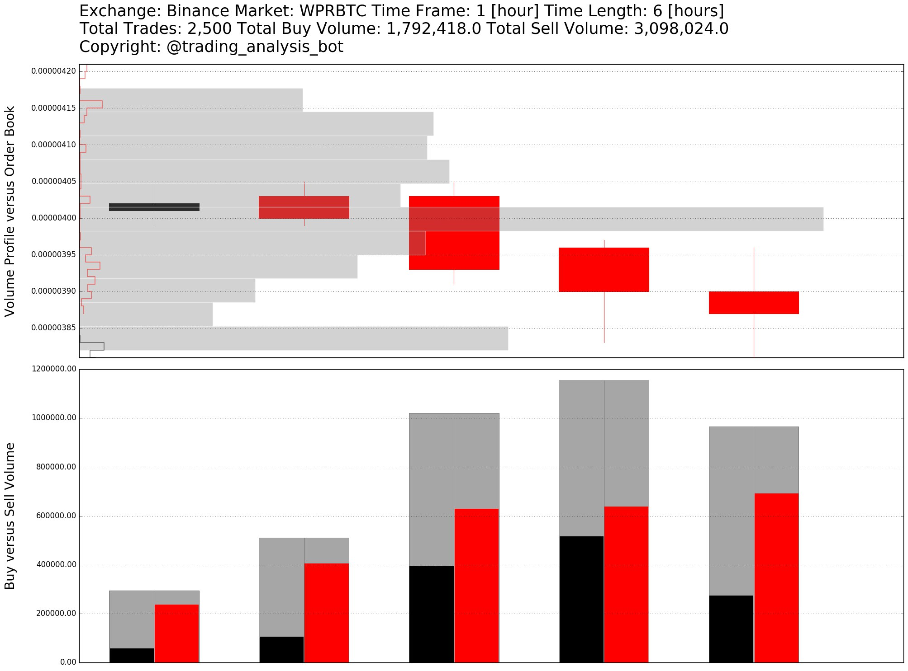
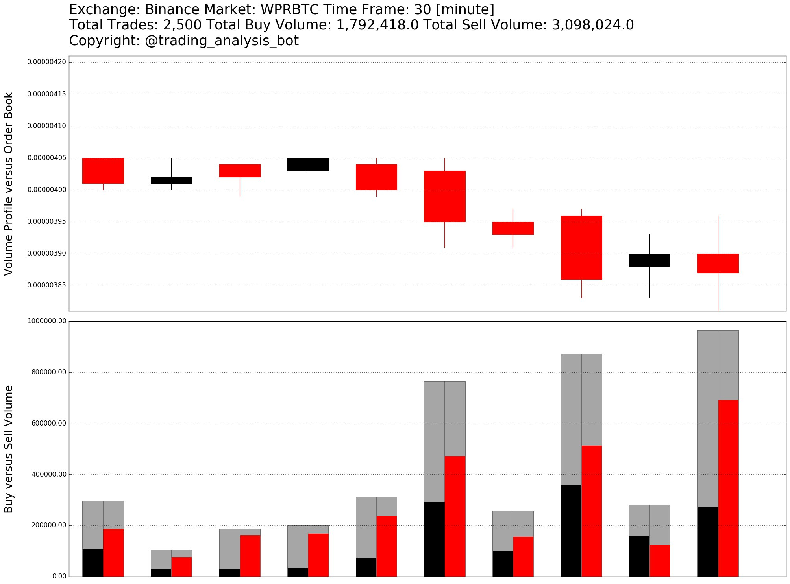
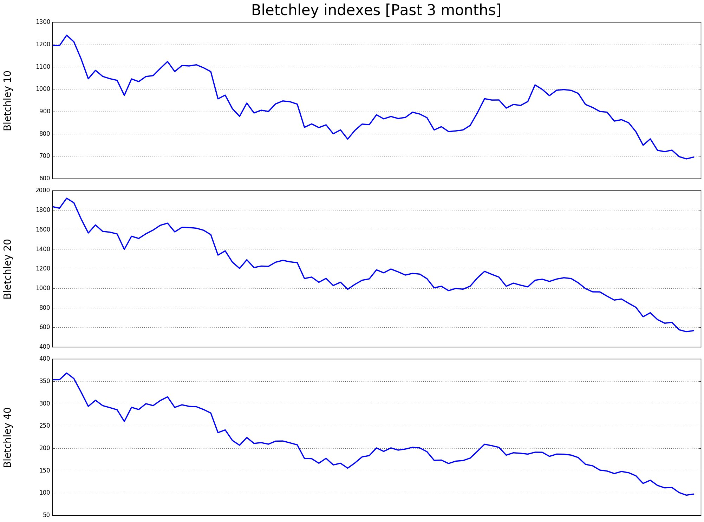
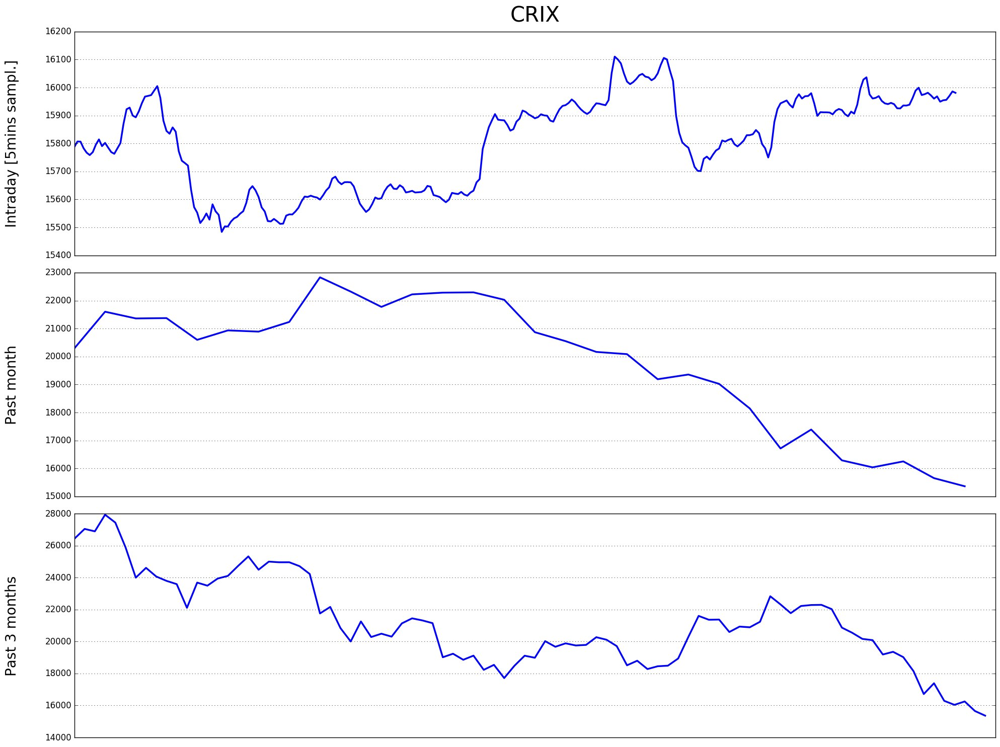
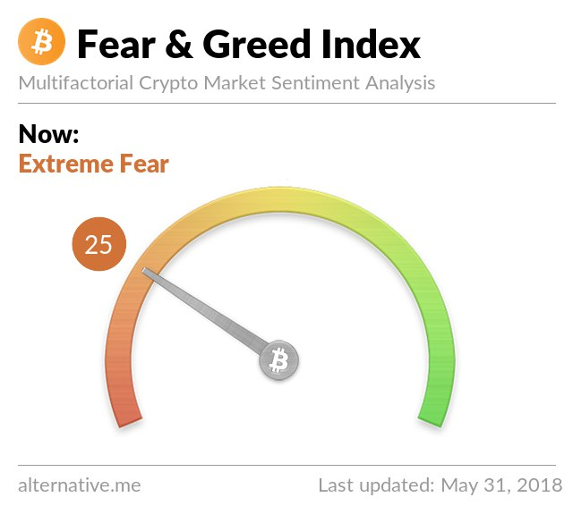
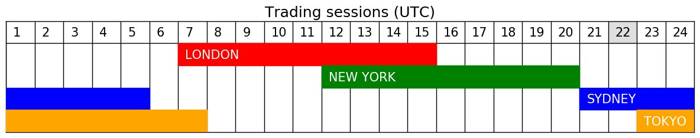

# Trading Analysis Bot

[](https://opensource.org/licenses/MIT)

<a href="https://t.me/trading_analysis_bot"></a>

**Trading Analysis Bot** is a Telegram chatbot for data-driven analytics of cryptocurrencies market, particularly the Binance exchange. It provides standard technical indicators, social sentiment and developer activities. Market indexes, rankings and statistic metrics based on on-chain transactions across different blockchain networks are also reported.

## Requirements

- Telegram library: python-telegram-bot
- Exchange library: python-binance
- Computational libraries: numpy, TA-lib
- Visualization library: matplotlib
- Database library: psycopg2

## Features

- Technical indicators: RSI, MA, BB, etc
- Order flow: buy vs sell, volume profile, limit orderbook
- Cryptoasset indexes: Bletchley, Bitwise, CRIX
- Cryptoasset metrics: TX vol, NVT ratio, num active addresses, num transactions
- Social sentiment and developer activities: Twitter, Reddit, Facebook, GitHub
- Trading sessions
- Customized notifications
- Administrator and user management

## Run on local machine

```
pip install -r requirements.txt
pip install TA-lib
```

```
# For Windows
set TELEGRAM_TOKEN=XXXXXXXXXXXXXXXXXXXXXXXXXXXXXX 
set SECRET_KEY=XXXXXXXXXXXXXXXXXXXXXXXXXXXXXX 
set API_KEY=XXXXXXXXXXXXXXXXXXXXXXXXXXXXXX
set DB_NAME=XXXXXXXXXXXXXXXXXXXXXXXXXXXXXX
set DB_USERNAME=XXXXXXXXXXXXXXXXXXXXXXXXXXXXXX
set DB_HOST=XXXXXXXXXXXXXXXXXXXXXXXXXXXXXX
set DB_PASSWORD=XXXXXXXXXXXXXXXXXXXXXXXXXXXXXX
set ADMIN_ID=XXXXXXXXXXXXXXXXXXXXXXXXXXXXXX
set ADMIN_USERNAME=XXXXXXXXXXXXXXXXXXXXXXXXXXXXXX
python bot.py
```

```
# For Linux
export TELEGRAM_TOKEN=XXXXXXXXXXXXXXXXXXXXXXXXXXXXXX 
export SECRET_KEY=XXXXXXXXXXXXXXXXXXXXXXXXXXXXXX 
export API_KEY=XXXXXXXXXXXXXXXXXXXXXXXXXXXXXX
export DB_NAME=XXXXXXXXXXXXXXXXXXXXXXXXXXXXXX
export DB_USERNAME=XXXXXXXXXXXXXXXXXXXXXXXXXXXXXX
export DB_HOST=XXXXXXXXXXXXXXXXXXXXXXXXXXXXXX
export DB_PASSWORD=XXXXXXXXXXXXXXXXXXXXXXXXXXXXXX
export ADMIN_ID=XXXXXXXXXXXXXXXXXXXXXXXXXXXXXX
export ADMIN_USERNAME=XXXXXXXXXXXXXXXXXXXXXXXXXXXXXX
python bot.py
```

## Deployment on Heroku platform

```
heroku create trading-analysis-bot --buildpack heroku/python
heroku buildpacks:add --index 2 https://github.com/numrut/heroku-buildpack-python-talib
heroku config:set TELEGRAM_TOKEN=XXXXXXXXXXXXXXXXXXXXXXXXXXXXXX
heroku config:set SECRET_KEY=XXXXXXXXXXXXXXXXXXXXXXXXXXXXXX
heroku config:set API_KEY=XXXXXXXXXXXXXXXXXXXXXXXXXXXXXX
heroku config:set DB_NAME=XXXXXXXXXXXXXXXXXXXXXXXXXXXXXX
heroku config:set DB_USERNAME=XXXXXXXXXXXXXXXXXXXXXXXXXXXXXX
heroku config:set DB_HOST=XXXXXXXXXXXXXXXXXXXXXXXXXXXXXX
heroku config:set DB_PASSWORD=XXXXXXXXXXXXXXXXXXXXXXXXXXXXXX
heroku config:set ADMIN_ID=XXXXXXXXXXXXXXXXXXXXXXXXXXXXXX
heroku config:set ADMIN_USERNAME=XXXXXXXXXXXXXXXXXXXXXXXXXXXXXX
git push heroku master
heroku ps:scale bot=1 
```

## Screenshots

### General information
```
/i zrx
```
```
Symbol: ZRX Name: 0x
Community (Reddit, Facebook, Twitter)
- Facebook likes: 1240
- Reddit average comments 48h: 2.5
- Reddit accounts active 48h: 2898
- Twitter followers: 134515
- Reddit subscribers: 13784
- Reddit average posts 48h: 0.417
Developer (Github)
- Forks: 199
- Commit count 4 weeks: 519
- Closed issues: 114
- Pull requests merged: 567
- Subscribers: 86
- Stars: 785
- Pull request contributors: 33
- Total issues: 146
```

### Transactions statistics
```
/t arn
```
```
#ARNBTC: 0.0000383
Transactions statistics (Last 500 trades)
From 2018-08-15 20:53:49 to 2018-08-15 22:50:31 (UTC)
~ 0$: Buy 4 vs Sell 113
~ 1-10$: Buy 15 vs Sell 5
> 100$: Buy 99 vs Sell 69
> 200$: Buy 64 vs Sell 26
> 500$: Buy 8 vs Sell 1
> 1,000$: Buy 0 vs Sell 0
> 2,000$: Buy 0 vs Sell 0
> 5,000$: Buy 0 vs Sell 0
> 10,000$: Buy 0 vs Sell 0
Total: Buy 216 (30,082$) vs Sell 284 (17,488$)
```


### Order flow
```
/a wpr 2500
```



### Cryptoasset indexes
```
/m
```




### Trading sessions
```
/h
```


## Licence
MIT

## Support and Donation

- Star and/or fork this repository
- Trade on Binance: https://www.binance.com/?ref=13339920
- Trade on Huobi: https://www.huobi.br.com/en-us/topic/invited/?invite_code=x93k3
- BTC: 1DrEMhMP5rAytKyKXRzc6szTcUX8bZzZgq
- ETH: 0x3915D216f9Fc6ec08f956555e84385513dE5f214
- LTC: LX8GJkGTZFmAA7puCyVp48333iQdCN6vca
